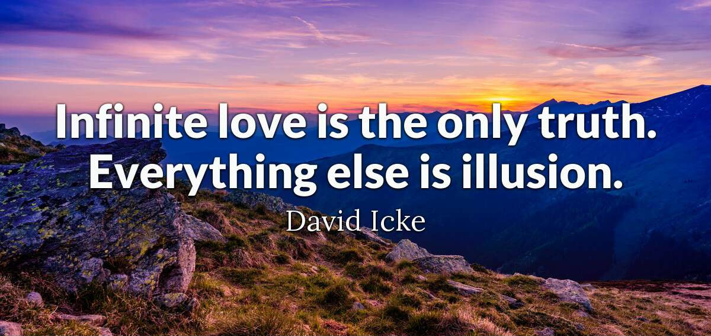

You are welcome in my humble abode.

## What does this site offer?

This site is conceived to be a collection of tools and frameworks for reality interpretation and manipulation, from the inside outwards.

There are guides, exposès, and recounts of key personal experiences, with the intent to transmit novel ways of thinking, of seeing, of decoding what happens inside and outside us. 

Our mind is structured to evolve and form our experience based on our paradigm, our beliefs, our intent, and our general understanding of life. Thus, it is possible to shift our experience of reality by acquiring and applying new decoding/encoding frameworks.

> "The real voyage of discovery consists, not in seeking new landscapes, but in having new eyes." - Marcel Proust

A foundational belief on which this effort operates is the existence of a reality that is more substantial and far greater than the physical-material plane of existence, a reality that is literally made out of pure love, and upon which all our experiences rest.

It is with the intention of bringing people closer to the experience of this love that I write these words. Deep inside we find a ceaseless striving towards something *more*, something *better*, and if listened properly, this small still voice will draw us to the still center point within ourselves, where we can find our truest guidance and our truest self.

This little corner of the internet is designed to provide tools for the seeker to find themselves; to interact in a more harmonious, loving way with themselves and with what surrounds them; and to help them see all of creation, personal or otherwise, as our greatest intent and mission made manifest.

> If you seek first the realities of heaven you ennoble the truth-learning constituent within you and ripen its natural urge to express a brotherhood of love that extends to all creatures great and small, near and far, wise and weak.
> 
> It is this form of love that congeals as the power of infinite goodness and mercy. It is the greatest folly of man to place the realities of earth above his innate pursuit of the divine within himself and his fellow beings. It is this, and nothing more, that obscures his understanding of his place in the universe of universes.

## Who is this site for?

This site is mainly aimed at the spiritual person—that is, the truth-seeker.

> Teacher: And how does a spiritual person behave?
> 
> Student: They are poised and benevolent. They are tranquil in the face of distractions and fears. They exude peace and exemplify compassion. They express divine love to all.
> 
> Teacher: You have adequately described a mythological saint, but you have not described a spiritual person. Even in total darkness, a spiritual person can discover light. They are truth seekers and they wear the countenance of a thousand different personalities. They are not truth tellers. They are not truth expressers. They are not saints. They are truth seekers.

## Where are these quotes from?

All quotes without attribution come from the [Wingmakers Materials](//wingmakers.com). It is a large collection of philosophical, narrative, and lyrical texts, along with audio and sound multimedia, designed to expand the consciousness of the inquirer and student.

## How is this site made?

Just github-hosted [docsify](https://docsify.js.org/) plus some CSS tinkering, very painless and straightforward. I thank Vega of [Opinionated Guides](https://opguides.info/posts/howimakeopguides/) for the tip, and the layout inspiration.