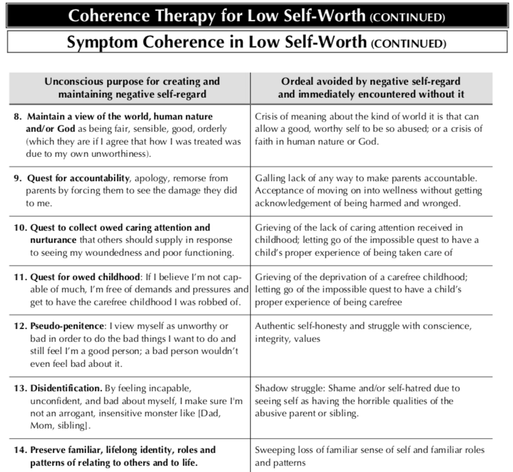

# {{title}}

#### {{date}}

 

Ever had those fantasies in which you dominate your oppressors, your bullies etc.? Well, last time in mine, once I was on top, I went "I don't really want to hurt you. I don't even have any beef with you. I just want my self-respect back."

And then I cried, because that's tragic, right? As much as I felt that it's something they took away from me, my self-respect wasn't something they stashed away somewhere. It was not something they could give back to me. They were empty-handed.

So where was it?

Self-respect wasn't something that they took from me. Rather, it was something I stopped giving myself at some point. 

The issue kept showing in dreams as people harassing, insulting and belittling me, but the bullying was just a symbol, like all things in dreams are.

It was a signifier to the deeper signified that internally I wasn't respecting myself. I didn't have a coherent, harmonious self-organization, and that showed in my life with the inner discord, the lack of ability to commit to things and to be resolute on anything for once.

Developing a strong, collected self is part of the process of human growth, but that can be slowed down by external factors, like people who make it difficult to be able to stand up for yourself, defend your needs, values and desires.

People look for self-realization a lot in media, all the more because the need is unconscious and unsaid: characters with a strong sense of themselves, and/or going through a maturing process that brings them much closer to this established independence and self-collectedness.

Coherent characters are very appealing; not only because their inner harmony is pleasing, but because they become shining ideals of having an integrated sense of themselves, and of living it with all the naturalness and spontaneity of an animal living its nature.

Video games especially provide the means for someone to live out one's self-realization by proxy, oft providing one or more characters with simplified, if not skeletal, arrays of needs and wants, complete with straightforward paths to satisfy the needs and achieve the wants.

Accomplishing a different persona's self-realization quests leaves the escapist player with a sense of accomplishment, which however fades quickly once returning to the other life outside the game, which still lies unfulfilled.

IRL, it's difficult for people who found themselves behind the curve to catch up because 1) nobody's explicitly telling them what to do about it, 2) by then most have found all manner of compensations and "fixes" to the situation, and dug themselves into several sunk costs.

The classical example of compensating for the lack of a centered self is people deriving their sense of worth not intrinsically as human beings, but conditionally on their wealth, or their achievements, or their responsibilities. This is also often tied to depending on others' opinion of ourselves as way to determine our self-worth.

While possibly noble, all of those are just deeply unsuited for the purpose of validating one's existence to themself, leaving one feeling empty. They're also contingent, and may just disappear one day, dealing a MASSIVE blow to one's self-esteem.

> "Care about people’s approval and you will always be their prisoner." - Lao Tzu

Internally, often the system still tries to heal, to break out of bad patterns, to find SOME way for the self to truly assert itself, to prove to itself that they can truly take care of their own system, that they can listen to it, defend it, nurture it, cultivate it.

People remain stuck in past events by the need to prove to themselves that one day, even that won't be enough to shake them; that [no amount of beatings or cruel or careless words](https://youtu.be/0uDGyBdyuWM?t=313) will destabilize them as it once did.

Ever wondered why people have such violent thoughts? Could it be a means of the ego to prove to itself its own stability, its ability to defend itself in time of desperate need, because it is not yet rooted in that which provides a natural, true sense of firmness?

Low self-esteem is a vicious cycle of being disconnected from one's needs and desires, and/or being un-tooled to act on them, leaving one frustrated and dissatisfied with life and esp with themselves, thus pushed to further self-rejection.

So many are left unaware of many of their basic emotional needs, to say nothing of their desires! Having had to accommodate some distorted vision of what they SHOULD be or do, they couldn't afford the space to explore what it means to actually just BE THEMSELVES.

To catch up, even with the aforementioned awareness and tools, many people still have a overwhelming fear to face: that a budding self is fragile, and can be snuffed out, much like it happened years back. It is a place of immense vulnerability.

Putting one's sense of self into discussion is a gamble, a tremendously delicate one, and renegotiating it with the environment is a severely smoother ride if the environment is forgiving and allowing in the dealings, so that shortcomings are forgiven.

And yet, the act of growing up always remains something under the complete responsibility, AND power, of the individual, much in the same way as a plant will only grow of its own doing. Much like with the plant, the environment is important, but it is not the doing.

Picking up what was left undone in your maturing process, and completing it, is something that only you can do, but this in fact means that it is something you CAN do! No one else has the power to do it for you, one way or another. Which means it sits right in your hands.

Some environments are hostile to efforts to reshape one's self, and it is fully understandable to not push for radical change where not felt appropriate. Times change, and they can change even faster under conscious direction: the right moment can be somewhere in the future.

The thing to keep in mind is that those people who hurt you have nothing to give back to you, because they took nothing from you. They just stopped you from doing something, and you can always start doing that something again. And that something is loving yourself.

The moment people made you think that you weren't enough just the way you were, that you needed to do something or to be or behave some specific way, and you believed it, was the moment that you didn't accept the way you were any longer. You were duped into conditional love.

Loving yourself is being aware of yourself enough to realize that this existence puts you into limitations that don't allow you to just mold yourself to whatever deranged vision others may ask of you. There are such things as unreasonable requests toward you.

There are undeniable needs, and preexisting desires. There is a STRUCTURE to being you that has to be acknowledged, respected, and honored. Living this is demonstrating to yourself that you are worth respecting for who you are, not for anything that you do or have.

There's an art to living with oneself. Taking things both seriously and lightheartedly, as the moment demands; it's a dynamic balance, an ongoing game. Like forgiving yourself for a shortcoming and accepting it as part of the human condition, but also studying it to improve.

It's the paradox of accepting yourself, but not as a fixed thing, but instead as ongoing, transforming process. Flexible in some ways, firm and rooted in others. It involves figuring out which is which, playing with them, and perhaps reinventing some of it eventually.

Unconditional love includes being able to appreciate something exactly for the way it is; not in the sense that they HAVE to be a certain way, but in that each and every expression is always a perfect manifestation of a deeper Motive, or Energy, or Intent.

It includes the acceptance of our inability to truly judge something, because of our limited point of view, and an (eventual) firm expectation that things do cohere into a greater, beautiful whole, in the same way that even a mole has a rightful place on Marylin Monroe's face.

To recognize the beauty inherent in yourself, it's useful to start from others first; it is easier to do because it does not run into your own fears wrt self-reevaluation. Learn to appreciate the world, then turn it back on yourself.

It is important to recognize that many early coping mechanisms may have involved lying to ourselves, in order to preserve a modicum of sanity. Once in a safe enough situation, our beliefs about ourselves are rife to be picked apart.

Loving yourself is a way of life. It's a different way of relating to yourself, each and every moment, and it changes everything, like relating differently to another person changes everything about them, in the way they show themselves to you.

Different parts of yourself will come to surface once you treat yourself differently. At least, this will likely happen gradually, since the way of love is through behaviours, which shape themselves into habits, and it takes time and persistence to accrue those.

Others can only show you the way; no matter how much light is in their words and acts, and how inspirational they can be for you, the path is through the darkness of your own fears. The light will show the way, but the way still has to be walked.

The path is not easy, nor it is short, but it is simple enough to describe: it is loving yourself. That's it. Loving yourself in the most wholesome, understanding way you can, every moment you can.

Making the sincere effort to learn to do so is already love, made manifest.

## Addendum: Coherence therapy for low self-worth

 

