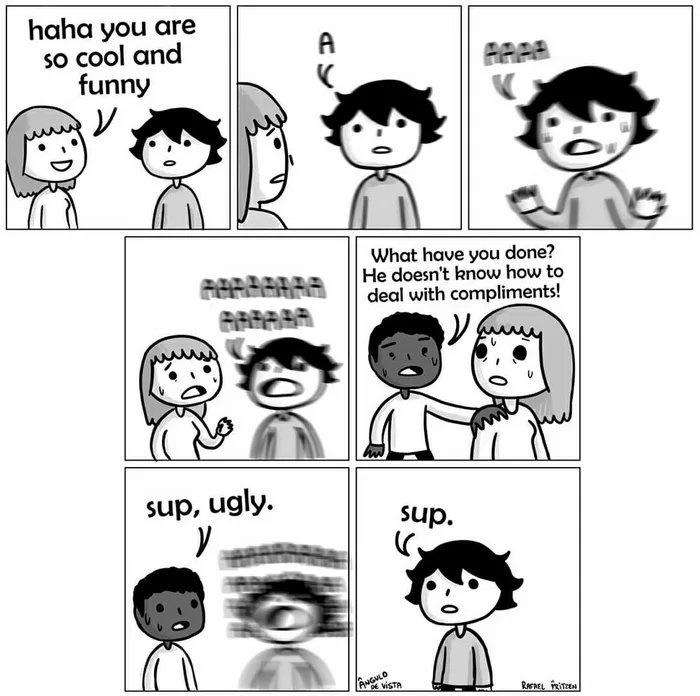

# {{title}}

#### {{date}}

 

You know that thing where people are unable to take compliments gracefully?

Yeah, I bet you do.  
And I'm not talking about just that; more generally, it's all these hitches in life about seemingly small, but fundamental issues.

Everywhere there's people that have trouble with being able to take compliments, with enjoying what they do, or to enduringly be pleased, or doubting their own (established) abilities. 

At the core, these are issues of relationship with oneself:

They cannot appreciate *themselves*, so they can't parse compliments.

They can't enjoy *themselves*, so they can't enjoy things.

They cannot please *themselves*, so they remain un-pleased by life.

They doubt their own abilities, since they don't trust *themselves*.

As within, so without; issues with relating to the world and with relating to oneself are one and the same.

And so, being poor at self-care includes attracting abusive/mistreating people, while putting aside the people that would be able to contribute to a healthy, joyous life.

For some, this rift in self-care is so deep, that in their model they absolutely *cannot* take care of themselves properly, and conjointly, people who would be able to take care of *them* properly do not physically exist.

And that's because one's seen enough in their youth to come to that conclusion. We form the biggest part of our worldview in the early years, and deep down one feels that if such people existed, they would, they *should* have been right there when they were needed the most.

Instead, one's very often faced with incompetence (malicious or otherwise) that makes one feel unhappy, unloved, misunderstood, no matter how much we try to do better, or how much we try to hide our feelings' conclusion from ourselves. Deep down, we can't escape how we feel.

What is the enduring message that one subconsciously derives through mistreatment? What is the understanding that one develops from the wounding behaviour of other people?

> "I'm not worthy of the kind of love I wish I'd receive."
 
> "I cannot be understood, much less accepted."

> "I am impossible to please."

> "I cannot be taken care of satisfyingly."

> "I am not equal, but inferior to the adults."

> "My actions are small and have little significance in the adult world."

> "Love is expressed by doing senseless or cruel actions."

Needless to say, these beliefs become the foundation of our relationship with ourselves, because early on we internalize others' relationship with us to form the basis of our own self-relating.

To add to that, the smallness felt when young remains even when adult, because we never really abandon our younger selves. Through the years, we just become it *plus* something else; we become *more* than we were before.

And so, some people become stuck in a situation in which not only they mistreat themselves, through acts both deliberate and not, both chronic and acute, both on the inside and on the outside,

but also in which they believe deep down that there is nothing more to do and understand that can help this situation, since none was found helpful when it counted most.

Nevertheless, the hunger for care remains, and given this barrier of belief, I've seen people displace such hunger in their fantasies to non-human care, or to questionable-motives care, or to straight-up abusive care (including kidnapping, raping, violence etc.)

Eg. We all recognize the importance of the plush animal for many kids as a way to perceive comfort and affection, which is profoundly disturbing if thought about for two seconds: why does the child have to settle for finding such very social emotions in an inanimate object?

It's important to note that such deep-rooted beliefs are effectively our core programming, and they will continue to shape our perception of reality unless addressed, in many ways *forcing* reality to conform to them when challenged, through the sheer impulse to homeostasis.

There is so much effort that people take in self-development that goes wasted because at our core we believe to be irredeemable and hopeless, and so we drag ourselves right back to the starting point, deep down believing that to be our lot.

To have real hope of changing ourselves, we have to deeply understand (feel!) that we *can* change. We *can* understand ourselves. We *can* have a satisfying, joyful life. We *can* be proud of ourselves every day. We *are* important and meaningful.

Strong feelings and emotions are the keys to deprogramming, in the same way that it is strong feelings+emotions that carved our worldview in our psyche in the first place. Logic alone cannot bring someone out of a hole that feelings+emotions put them in.

If deep down we don't **feel** we can, then all our work will be undone behind the scenes, like Penelope's shroud being unraveled each night after a day's weaving.

We have to realize how deep our rabbit hole goes. By facing our reality, our programming, we have our only real chance of grabbing life by the horns so that we can steer it.